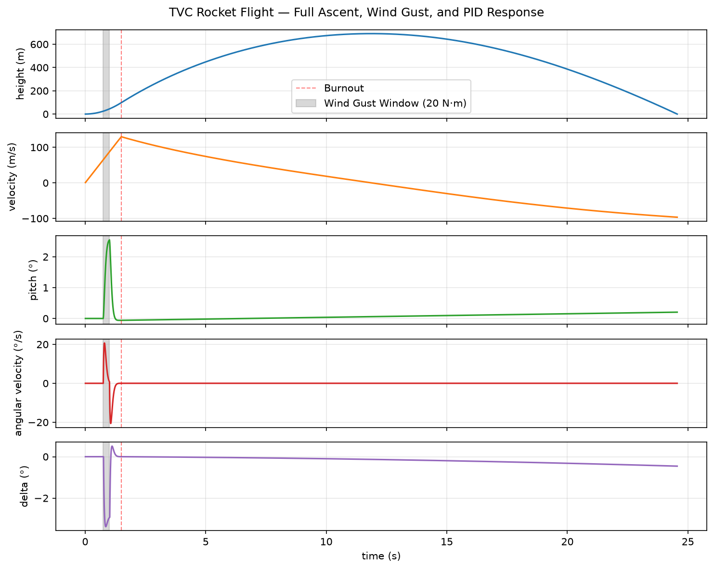

# TVC Rocket Ascent Simulator

2D Thrust Vector Control simulator, built from scratch in Python. A closed-loop PID controller now actively corrects pitch during the burn

**Status:** Phase 4 (static telemetry) complete.

## Quickstart

```bash
git clone https://github.com/hidekelirizarry/tvc-simulator
cd tvc-simulator
python main.py
```

## What's working (Phase 1)

Translational dynamics, verified against hand calculations before moving on.

- Variable-mass ascent under thrust, gravity, and drag
- Semi-implicit Euler integration at 100 Hz
- Direction-aware drag (opposes whichever way the rocket is currently moving)
- Linear interpolation to correct the landing overshoot from discrete timestepping
- Phased console output (burn, burnout, descent, landing) plus a flight summary: apogee, max velocity, max acceleration, burnout height and velocity

## What's working (Phase 2)

Rotational mechanics, built the same way as translation: one function per physical quantity (torque, moment of inertia, angular acceleration, angular velocity, pitch).

- Thrust splits by gimbal angle into a translational component (T cos δ) and a torque-producing component (T sin δ); both are now accounted for
- Rotational state (pitch, angular velocity, angular acceleration) is stored internally in radians, matching the physics behind τ = Iα, and converted to degrees only at print time
- Flight summary extended to include max pitch, max angular velocity, and max angular acceleration

## What's working (Phase 3)

Closed-loop pitch control replacing Phase 2's fixed-angle gimbal, plus disturbance testing to actually validate it rather than just trust it.

- PID controller (`controller.py`) fully decoupled from the physics plant: takes current pitch and angular velocity as parameters instead of reaching into `rocket_state` directly
- Error and its rate of change derived by hand from calculus (error = -pitch, rate of error = -angular velocity) rather than assumed; gain units derived and verified (Kp unitless, Ki in 1/s, Kd in seconds)
- Anti-windup implemented as conditional integration: the accumulator freezes only when the gimbal is saturated and the current error would push it further into saturation. Verified both by confirming saturation actually occurs on real test data and by an A/B comparison against a version with the freeze disabled
- Gains tuned entirely through evidence and testing: started at values that saturated the actuator on essentially every tick, worked down through several iterations isolating one variable at a time, settled on Kp = 1.1, Ki = 0.1, Kd = 0.1
- Scripted wind gust disturbance, a time-windowed additive torque in `step()`, added to test rejection of a mid-flight disturbance rather than just recovery from a bad initial condition; tested across gust magnitude, duration, and timing
- Found a real limitation while stress-testing disturbance timing: a gust landing too close to burnout leaves the controller still mid-correction when thrust cuts off. With zero torque authority afterward, whatever angular velocity remains at that instant persists unchanged through the entire unpowered coast. Confirmed this is a control-authority-timing limit tied to the deferred passive aerodynamic stability model (see assumptions), not a flaw in the PID or TVC approach itself
- Final flight summary extended with max gimbal deflection and corrected to preserve sign on negative extremes, previously only captured the largest positive value for pitch and angular acceleration

## What's working (Phase 4)

<p align="center">
  
</p>

Telemetry logging and a full static visualization pipeline, turning the console output into actual visual proof.

- Flight state (`state_list`) exported to CSV after each run, one row per timestep, delta merged in alongside the physics state
- `visualizer_static.py` reads the CSV back and produces a 5-panel telemetry figure: height, velocity, pitch, angular velocity, and gimbal deflection, all plotted against a shared time axis
- Burnout and the wind gust window are marked directly on the figure, gust window label pulls its torque value live from `constants.py` so it stays accurate if the gust is retuned

## Roadmap

- [x] Phase 1: Translational dynamics, drag, landing interpolation, flight summary
- [x] Phase 2: Rotational mechanics, pitch, angular velocity, moment of inertia, gimbal torque
- [x] Phase 3: PID controller with anti-windup, wind gust disturbance testing
- [x] Phase 4: Telemetry logging, static charts

## Assumptions & Known Limitations

- Constant average thrust; real thrust curve planned as a later fidelity pass
- Constant sea-level air density; altitude-based model planned as a later fidelity pass
- Placeholder airframe values (mass, drag coefficient, diameter, length), not yet based on measured hardware
- Moment of inertia treats the rocket as a uniform rod (uniform mass density, cylindrical body), doesn't yet account for nose cone taper or the motor's actual off-center mass
- Wind gust disturbance is a simplified scripted torque with a fixed magnitude and time window, not a real aerodynamic model
- No passive aerodynamic stability (fins) modeled yet; the vehicle has zero restoring torque once thrust cuts off, so any pitch or angular velocity error remaining at burnout carries unchanged through the rest of the flight. A real airframe's fins would naturally damp this out during the coast, this is the specific gap Phase 3 testing exposed

## Future Directions (v2)

Once this version is polished and up, planning a broader rebuild rather than continuing to bolt features onto the phase-based structure:

- Selectable rocket/motor presets instead of one hardcoded configuration
- Passive aerodynamic stability (fins), the gap this project's own Phase 3 testing exposed
- Auto-tuning PID gains for whatever configuration is loaded, likely starting from a model-based estimate derived from the analytically-computed moment of inertia, rather than a blind search
- Live-editable constants (an in-app control panel instead of hand-editing `constants.py`)
- Real sprite-based animation, building on the rotation/timing logic already proven in `visualizer_live.py`

## Repo structure

- `constants.py`, motor, physics, and PID/gust constants
- `physics_plant.py`, the simulation engine
- `controller.py`, PID controller with anti-windup
- `main.py`, driver script: simulation loop, wind gust scripting, startup and summary printouts, CSV export
- `visualizer_static.py`, static telemetry plotting (Phase 4)
- `visualizer_live.py`, live animation prototype, rotation/timing mechanics proven, parked pending real sprite assets (v2)